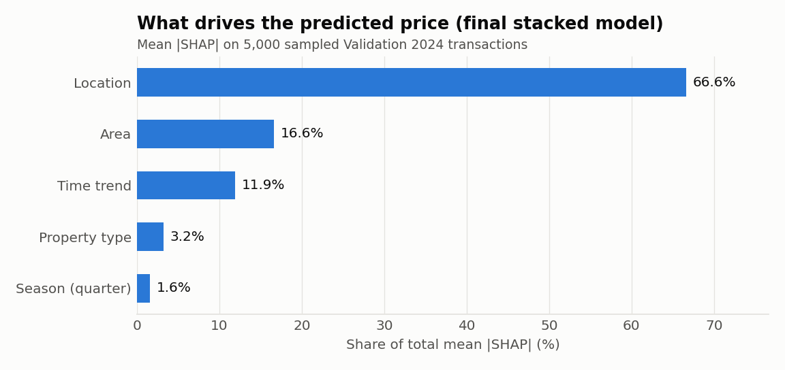
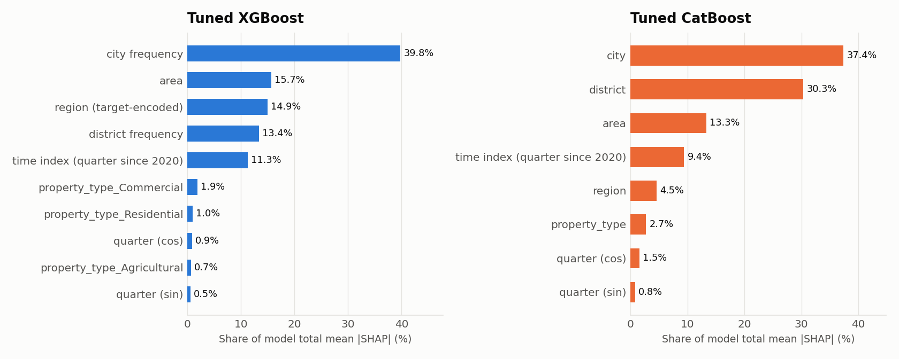
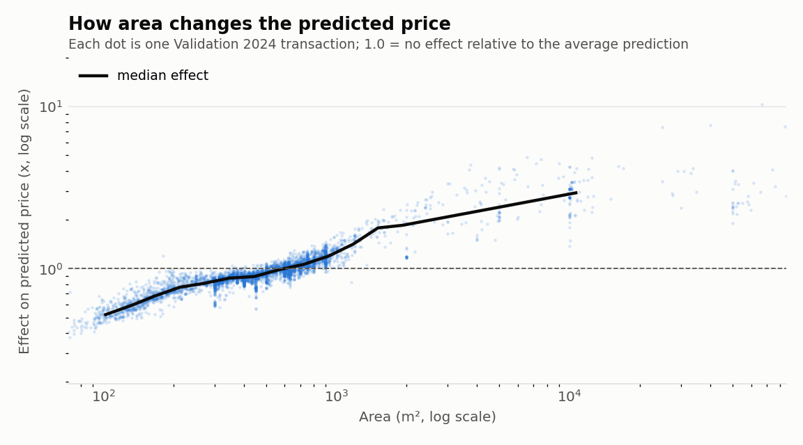
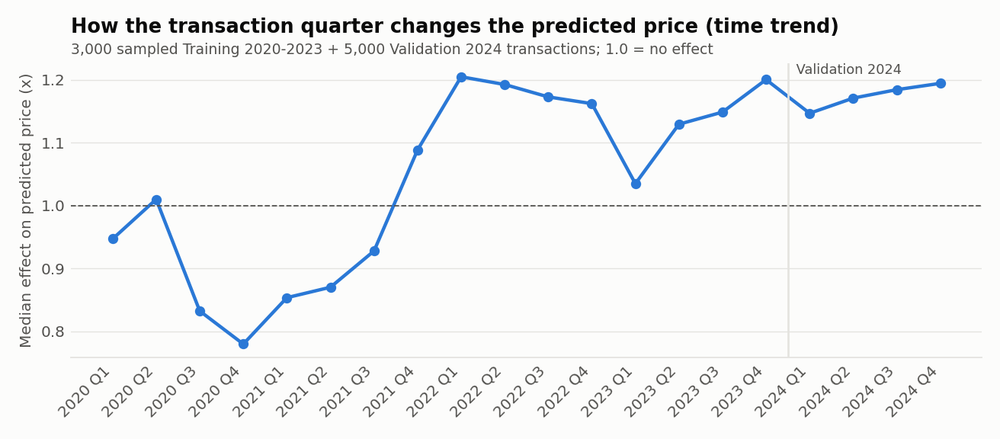

# Hyperparameter Tuning

> **Status:** sections 1–2 are the earlier exploration and are kept as they were. Sections 3–9 add the
> hyperparameter search for XGBoost, CatBoost and MLP, the two-model stack, the Validation 2024 comparison,
> the final selection, and a single Test 2025 evaluation of the frozen selection. Section 10 shows which
> characteristics drive the predicted price.
> The Initial Modeling stage (baseline + Initial XGBoost / CatBoost / MLP) is reported separately in
> `outputs/initial_models/reports/initial_models_report.md`.

Generated by `src/tuning/make_tuning_wip_report.py` from saved tuning tables only.

## 1. Test-set methodology note (important)

- **Test 2025 was evaluated for the initial models.**
- **It was later evaluated again for the v2 experiment** (XGBoost v2 and the 50/50 ensemble).
- Therefore the v2 Test 2025 results are a **second look** and are **not equivalent to a completely untouched final holdout**.
- **No future hyperparameter or model decision may use Test 2025.** All future tuning must use
  **Training 2020–2023 and Validation 2024 only**.
- Existing Test 2025 results are preserved unchanged and were not recalculated when this report was produced.

## 2. Earlier exploration (before the full search)

### 2.1 XGBoost `min_child_weight` trials (validation only)
Initial XGBoost used `min_child_weight = 5`. The values 50, 200 and 1000 were then evaluated on Validation 2024
(everything else unchanged, early stopping on Validation 2024):

| min_child_weight | trees_kept | val_mae_sar | val_rmse_sar | val_r2_sar | val_r2_ln_price | train_seconds |
|---|---|---|---|---|---|---|
| 50 | 1216 | 531,509 | 7,401,742 | 0.3129 | 0.7118 | 43 |
| 200 | 1406 | 523,325 | 7,198,783 | 0.3501 | 0.7090 | 65 |
| 1000 | 2684 | 541,422 | 7,646,554 | 0.2667 | 0.6989 | 114 |

Among these three trials, `min_child_weight = 200` gave the strongest validation result
(lowest Validation MAE, 523,325 SAR). This is only a three-value trial, not a search of the parameter space.

### 2.2 XGBoost v2 — a tuning-stage model
XGBoost v2 is Initial XGBoost with `min_child_weight = 200`. It is a **tuning-stage experiment, not an initial model**,
and it has **not** been selected as the outcome of tuning. Its files are under `outputs/tuning/models/xgboost_v2/`.

### 2.3 50/50 XGBoost–CatBoost ensemble — a tuning-stage experiment
The ensemble averages XGBoost v2 and Initial CatBoost in `ln(price)` space with fixed equal weights (0.5 / 0.5).
**The ensemble weights were not tuned**: 50/50 was fixed in advance. During exploration a single 70/30 alternative was
glanced at on validation; it was not adopted, and no weight search was run. The ensemble is not an initial model.

### 2.4 Prediction-capping experiments (exploration only)
Capping predicted prices at high training-price percentiles was tried on Validation 2024 during the diagnosis of the
SAR-scale R² problem. Caps at lower percentiles made results worse; only a very loose cap looked useful, and none was adopted.
**These numbers were only inspected interactively and were not saved to a file**, so they are not reproduced here.
The experiment must be redone in a saved, reproducible script if it is pursued.

### 2.5 Validation 2024 comparison (saved)
Rows labelled v1 are the initial models, shown for reference.

| Model | Validation MAE (SAR) | Validation RMSE (SAR) | Validation R2 (SAR) | Validation R2 (ln price) | Median abs error (SAR) | MAE improvement vs baseline (%) |
|---|---|---|---|---|---|---|
| XGBoost v1 | 539,630 | 8,261,632 | 0.1440 | 0.7132 | 117,990 | 18.73 |
| CatBoost v1 | 554,411 | 7,638,329 | 0.2683 | 0.7019 | 130,865 | 16.50 |
| XGBoost v2 (min_child_weight=200) | 523,325 | 7,198,783 | 0.3501 | 0.7090 | 118,440 | 21.18 |
| Ensemble v2 (XGBoost v2 + CatBoost, 50/50) | 523,066 | 6,801,708 | 0.4198 | 0.7190 | 119,563 | 21.22 |

### 2.6 Test 2025 comparison (saved; second look, see section 1)

| Model | Test MAE (SAR) | Test RMSE (SAR) | Test R2 (SAR) | Test R2 (ln price) | Median abs error (SAR) | MAE improvement vs test baseline (%) | Met 15% target |
|---|---|---|---|---|---|---|---|
| XGBoost v1 | 596,077 | 12,670,756 | -0.7500 | 0.6497 | 130,469 | 12.28 | No |
| CatBoost v1 | 554,819 | 7,609,560 | 0.3688 | 0.6445 | 132,480 | 18.35 | Yes |
| XGBoost v2 (min_child_weight=200) | 561,276 | 8,655,182 | 0.1835 | 0.6488 | 130,179 | 17.40 | Yes |
| Ensemble v2 (XGBoost v2 + CatBoost, 50/50) | 545,026 | 7,647,744 | 0.3625 | 0.6604 | 128,683 | 19.79 | Yes |

Per-property-type results for this experiment: `outputs/tuning/tables/v2_per_property_type_test_metrics.csv`.
The earlier diagnosis and interpretation are in `outputs/tuning/reports/v2_r2_improvement_report.md`.

## 3. Hyperparameter search (XGBoost, CatBoost, MLP)

**Protocol.** seeded random search (numpy RandomState), settings drawn up front; seed `42`. Each trial is fitted on Training 2020–2023
(exported features whose frequency encoding, out-of-fold region target encoding and scaling were fitted on
2020–2023 only), with early stopping on Validation 2024 (RMSE of ln(price), as for the initial models), and is
scored by **Validation 2024 MAE in SAR** after `exp()` of the ln(price) prediction, clipped to the training
ln(price) range. The target is natural `ln(price)` (checked on load: `exp(y_log) == price`); `expm1` is never
used. Predictors are area, year/quarter features and location / property-type encodings only — no
`price_per_m2` or other target-derived column. **Test 2025 was not read by the search.**

Trial 0 re-runs each initial configuration (XGBoost trial 1 re-runs the earlier v2 setting), so the initial
results are reproduced inside the same search and tuning cannot select a configuration that is worse on
validation than the initial one. Budget, chosen for a 4-core / 16 GB laptop CPU: XGBoost 18, CatBoost 9, MLP 13 random trials on top
of the anchor trials. Fixed during the search: XGBoost {"n_estimators": 5000, "early_stopping_rounds": 50}; CatBoost {"iterations": 3000, "early_stopping_rounds": 50}; MLP {"max_epochs": 60, "early_stopping_patience": 8}. MLP Huber delta 1.0 (on ln(price)).
The MLP option `log1p_standardized` replaces the standardized raw area with standardized `log1p(area)` whose
mean / std come from the training rows.

### 3.1 Search spaces
| Model | Hyperparameter | Distribution | Range / options |
|---|---|---|---|
| XGBoost | `learning_rate` | loguniform | 0.03 – 0.15 |
| XGBoost | `max_depth` | choice | 6, 7, 8, 9, 10, 12 |
| XGBoost | `min_child_weight` | choice | 1, 5, 20, 50, 100, 200, 400, 800 |
| XGBoost | `subsample` | uniform | 0.6 – 1 |
| XGBoost | `colsample_bytree` | uniform | 0.6 – 1 |
| XGBoost | `reg_lambda` | loguniform | 0.1 – 50 |
| XGBoost | `reg_alpha` | loguniform | 0.001 – 5 |
| XGBoost | `gamma` | choice | 0.0, 0.01, 0.05, 0.2 |
| CatBoost | `learning_rate` | loguniform | 0.06 – 0.25 |
| CatBoost | `depth` | choice | 6, 7, 8, 9 |
| CatBoost | `l2_leaf_reg` | loguniform | 1 – 30 |
| CatBoost | `random_strength` | loguniform | 0.25 – 5 |
| CatBoost | `bagging_temperature` | uniform | 0 – 1 |
| CatBoost | `one_hot_max_size` | choice | 2, 16 |
| CatBoost | `max_ctr_complexity` | choice | 1, 2, 4 |
| MLP | `hidden_units` | choice | [128, 64, 32], [256, 128, 64], [512, 256, 128], [256, 256, 128, 64] |
| MLP | `learning_rate` | loguniform | 0.0003 – 0.003 |
| MLP | `batch_size` | choice | 1024, 2048, 4096 |
| MLP | `loss` | choice | "mse", "huber" |
| MLP | `dropout` | choice | 0.0, 0.1, 0.2 |
| MLP | `l2` | choice | 0.0, 1e-06, 1e-05 |
| MLP | `area_transform` | choice | "standardized", "log1p_standardized" |

### 3.2 Search summary
| Model | Trials run | Anchor trials | Random trials | Total search time (min) | Median time per trial (s) | Trial 0 (initial config) Val MAE | Best trial | Best trial source | Best Val MAE (SAR) | Iterations kept |
|---|---|---|---|---|---|---|---|---|---|---|
| XGBoost | 20 | 2 | 18 | 21.2 | 53 | 539,630 | 9 | random search | 518,149 | 1295 trees kept (early stopping) |
| CatBoost | 10 | 1 | 9 | 66.0 | 354 | 554,411 | 2 | random search | 537,330 | 851 trees kept (early stopping) |
| MLP | 14 | 1 | 13 | 32.1 | 56 | 977,813 | 2 | random search | 657,428 | 18 epochs (best epoch, weights restored) |

### 3.3 Best hyperparameters (searched keys; all other settings as in the initial configs)
| Model | Hyperparameter | Best value |
|---|---|---|
| XGBoost | `learning_rate` | 0.04954 |
| XGBoost | `max_depth` | 12 |
| XGBoost | `min_child_weight` | 200 |
| XGBoost | `subsample` | 0.8187 |
| XGBoost | `colsample_bytree` | 0.6739 |
| XGBoost | `reg_lambda` | 41.39 |
| XGBoost | `reg_alpha` | 0.7365 |
| XGBoost | `gamma` | 0.01 |
| XGBoost | iterations kept | 1295 trees kept (early stopping) |
| CatBoost | `learning_rate` | 0.1552 |
| CatBoost | `depth` | 9 |
| CatBoost | `l2_leaf_reg` | 8.02 |
| CatBoost | `random_strength` | 1.485 |
| CatBoost | `bagging_temperature` | 0.2506 |
| CatBoost | `one_hot_max_size` | 16 |
| CatBoost | `max_ctr_complexity` | 2 |
| CatBoost | iterations kept | 851 trees kept (early stopping) |
| MLP | `hidden_units` | [256, 256, 128, 64] |
| MLP | `learning_rate` | 0.00122 |
| MLP | `batch_size` | 4096 |
| MLP | `loss` | "huber" |
| MLP | `dropout` | 0.2 |
| MLP | `l2` | 1e-06 |
| MLP | `area_transform` | "log1p_standardized" |
| MLP | iterations kept | 18 epochs (best epoch, weights restored) |

Full configurations: `outputs/tuning/models/<model>_tuned/<model>_tuned_config.json`.

### 3.4 All trials (blank cells in anchor trials = the initial configuration's value)
**XGBoost**

| trial | source | learning_rate | max_depth | min_child_weight | subsample | colsample_bytree | reg_lambda | reg_alpha | gamma | iterations_used | val_mae_sar | val_rmse_sar | val_r2_sar | val_r2_ln_price | train_seconds |
|---|---|---|---|---|---|---|---|---|---|---|---|---|---|---|---|
| 0 | initial config | — | — | — | — | — | — | — | — | 1229 | 539,630 | 8,261,632 | 0.1440 | 0.7132 | 57 |
| 1 | earlier v2 setting | — | — | 200.0 | — | — | — | — | — | 1406 | 523,325 | 7,198,783 | 0.3501 | 0.7090 | 70 |
| 2 | random search | 0.05482 | 10.0 | 400.0 | 0.8928 | 0.8395 | 0.2637 | 0.003776 | 0.05 | 1738 | 519,460 | 7,284,543 | 0.3345 | 0.7127 | 106 |
| 3 | random search | 0.06282 | 10.0 | 50.0 | 0.6571 | 0.8604 | 0.142 | 0.4684 | 0.01 | 708 | 528,614 | 7,666,261 | 0.2630 | 0.7149 | 47 |
| 4 | random search | 0.04222 | 9.0 | 100.0 | 0.847 | 0.8447 | 0.1045 | 0.001217 | 0.05 | 1625 | 522,212 | 7,369,324 | 0.3190 | 0.7153 | 85 |
| 5 | random search | 0.08031 | 7.0 | 800.0 | 0.7169 | 0.7465 | 1.702 | 0.8023 | 0.05 | 1201 | 543,876 | 7,824,311 | 0.2323 | 0.6933 | 53 |
| 6 | random search | 0.05552 | 9.0 | 800.0 | 0.7867 | 0.944 | 6.857 | 0.04639 | 0.01 | 1393 | 534,075 | 7,644,283 | 0.2672 | 0.7022 | 73 |
| 7 | random search | 0.1382 | 9.0 | 200.0 | 0.9234 | 0.7218 | 0.1835 | 0.3396 | 0.05 | 550 | 527,960 | 7,273,361 | 0.3366 | 0.7100 | 42 |
| 8 | random search | 0.0901 | 9.0 | 100.0 | 0.9333 | 0.6693 | 1.136 | 0.004722 | 0.2 | 1001 | 526,730 | 7,571,308 | 0.2811 | 0.7132 | 46 |
| 9 | random search | 0.04954 | 12.0 | 200.0 | 0.8187 | 0.6739 | 41.39 | 0.7365 | 0.01 | 1295 | 518,149 | 7,245,252 | 0.3417 | 0.7158 | 66 |
| 10 | random search | 0.05667 | 9.0 | 200.0 | 0.8909 | 0.7306 | 3.464 | 0.08444 | 0.01 | 1684 | 526,377 | 7,250,084 | 0.3408 | 0.7130 | 69 |
| 11 | random search | 0.05064 | 10.0 | 5.0 | 0.8159 | 0.8347 | 40.29 | 0.176 | 0.0 | 1047 | 522,352 | 6,901,025 | 0.4028 | 0.7156 | 52 |
| 12 | random search | 0.03764 | 10.0 | 1.0 | 0.6063 | 0.7694 | 1.164 | 0.01218 | 0.05 | 957 | 546,228 | 9,037,008 | -0.0242 | 0.7149 | 52 |
| 13 | random search | 0.1115 | 6.0 | 800.0 | 0.8916 | 0.9085 | 0.1584 | 0.02118 | 0.0 | 1371 | 536,146 | 7,646,419 | 0.2668 | 0.6983 | 47 |
| 14 | random search | 0.1308 | 6.0 | 800.0 | 0.7798 | 0.6382 | 1.002 | 0.2979 | 0.0 | 1413 | 538,880 | 7,634,731 | 0.2690 | 0.6964 | 51 |
| 15 | random search | 0.09707 | 12.0 | 20.0 | 0.8245 | 0.7532 | 41.94 | 1.381 | 0.0 | 323 | 521,978 | 7,187,269 | 0.3522 | 0.7172 | 20 |
| 16 | random search | 0.07404 | 12.0 | 400.0 | 0.6162 | 0.8843 | 0.1992 | 0.04218 | 0.05 | 869 | 519,171 | 7,322,209 | 0.3276 | 0.7110 | 49 |
| 17 | random search | 0.03156 | 6.0 | 50.0 | 0.8253 | 0.8782 | 0.2377 | 0.1721 | 0.05 | 3956 | 539,156 | 8,063,088 | 0.1847 | 0.7083 | 188 |
| 18 | random search | 0.1012 | 9.0 | 100.0 | 0.6308 | 0.7159 | 0.2724 | 2.747 | 0.0 | 746 | 519,122 | 7,248,329 | 0.3411 | 0.7126 | 36 |
| 19 | random search | 0.04828 | 10.0 | 200.0 | 0.7826 | 0.6874 | 1.331 | 1.85 | 0.2 | 1330 | 524,505 | 7,465,876 | 0.3010 | 0.7127 | 62 |

**CatBoost**

| trial | source | learning_rate | depth | l2_leaf_reg | random_strength | bagging_temperature | one_hot_max_size | max_ctr_complexity | iterations_used | val_mae_sar | val_rmse_sar | val_r2_sar | val_r2_ln_price | train_seconds |
|---|---|---|---|---|---|---|---|---|---|---|---|---|---|---|
| 0 | initial config | — | — | — | — | — | — | — | 986 | 554,411 | 7,638,329 | 0.2683 | 0.7019 | 517 |
| 1 | random search | 0.07071 | 9.0 | 1.419 | 0.3904 | 0.1721 | 16.0 | 4.0 | 866 | 544,193 | 7,358,793 | 0.3209 | 0.7039 | 399 |
| 2 | random search | 0.1552 | 9.0 | 8.02 | 1.485 | 0.2506 | 16.0 | 2.0 | 851 | 537,330 | 7,512,971 | 0.2921 | 0.7089 | 345 |
| 3 | random search | 0.06097 | 9.0 | 1.213 | 3.353 | 0.221 | 16.0 | 1.0 | 770 | 560,880 | 7,351,200 | 0.3223 | 0.6782 | 364 |
| 4 | random search | 0.0942 | 9.0 | 4.114 | 1.768 | 0.6206 | 2.0 | 1.0 | 606 | 558,317 | 7,466,732 | 0.3008 | 0.6800 | 366 |
| 5 | random search | 0.2088 | 6.0 | 4.554 | 1.859 | 0.0825 | 16.0 | 1.0 | 643 | 580,115 | 9,334,288 | -0.0927 | 0.6791 | 223 |
| 6 | random search | 0.0918 | 7.0 | 3.097 | 0.8827 | 0.4448 | 2.0 | 2.0 | 1191 | 545,776 | 7,198,198 | 0.3502 | 0.7005 | 1229 |
| 7 | random search | 0.07568 | 6.0 | 21.99 | 3.82 | 0.5253 | 16.0 | 4.0 | 1107 | 549,158 | 7,325,455 | 0.3270 | 0.6992 | 262 |
| 8 | random search | 0.07767 | 8.0 | 1.685 | 1.031 | 0.609 | 2.0 | 1.0 | 746 | 558,954 | 7,135,219 | 0.3615 | 0.6797 | 172 |
| 9 | random search | 0.2237 | 7.0 | 21.12 | 0.4646 | 0.4044 | 16.0 | 1.0 | 508 | 568,135 | 7,827,991 | 0.2315 | 0.6814 | 84 |

**MLP**

| trial | source | hidden_units | learning_rate | batch_size | loss | dropout | l2 | area_transform | iterations_used | val_mae_sar | val_rmse_sar | val_r2_sar | val_r2_ln_price | train_seconds |
|---|---|---|---|---|---|---|---|---|---|---|---|---|---|---|
| 0 | initial config | — | — | — | mse | 0.0 | 0.0 | standardized | 5 | 977,813 | 24,512,976 | -6.5355 | 0.3667 | 23 |
| 1 | random search | [128, 64, 32] | 0.0008122 | 2048.0 | huber | 0.0 | 0.0 | log1p_standardized | 1 | 692,185 | 7,543,458 | 0.2864 | 0.4316 | 15 |
| 2 | random search | [256, 256, 128, 64] | 0.00122 | 4096.0 | huber | 0.2 | 1e-06 | log1p_standardized | 18 | 657,428 | 8,952,533 | -0.0051 | 0.4944 | 142 |
| 3 | random search | [128, 64, 32] | 0.0008031 | 2048.0 | mse | 0.0 | 0.0 | log1p_standardized | 5 | 741,773 | 13,622,262 | -1.3271 | 0.4473 | 27 |
| 4 | random search | [256, 128, 64] | 0.0007533 | 4096.0 | mse | 0.1 | 1e-05 | standardized | 15 | 689,740 | 7,721,377 | 0.2523 | 0.4620 | 1063 |
| 5 | random search | [256, 128, 64] | 0.0004133 | 4096.0 | mse | 0.2 | 1e-05 | standardized | 29 | 703,075 | 8,869,778 | 0.0134 | 0.4356 | 119 |
| 6 | random search | [256, 256, 128, 64] | 0.001387 | 4096.0 | mse | 0.0 | 1e-06 | log1p_standardized | 1 | 706,223 | 9,958,330 | -0.2436 | 0.4441 | 32 |
| 7 | random search | [256, 256, 128, 64] | 0.002429 | 2048.0 | mse | 0.1 | 0.0 | log1p_standardized | 5 | 675,647 | 10,774,042 | -0.4557 | 0.4824 | 88 |
| 8 | random search | [128, 64, 32] | 0.001869 | 4096.0 | mse | 0.0 | 1e-05 | log1p_standardized | 3 | 801,191 | 16,772,587 | -2.5279 | 0.4504 | 14 |
| 9 | random search | [256, 128, 64] | 0.0009742 | 2048.0 | huber | 0.2 | 1e-05 | log1p_standardized | 9 | 682,482 | 10,204,689 | -0.3059 | 0.4891 | 71 |
| 10 | random search | [256, 256, 128, 64] | 0.0005131 | 1024.0 | mse | 0.1 | 1e-06 | log1p_standardized | 13 | 661,781 | 9,057,756 | -0.0289 | 0.4930 | 199 |
| 11 | random search | [128, 64, 32] | 0.0004659 | 2048.0 | huber | 0.2 | 1e-06 | log1p_standardized | 9 | 681,194 | 8,990,601 | -0.0137 | 0.4756 | 40 |
| 12 | random search | [256, 128, 64] | 0.0003869 | 4096.0 | mse | 0.0 | 1e-05 | standardized | 3 | 862,155 | 18,755,758 | -3.4115 | 0.3699 | 22 |
| 13 | random search | [256, 256, 128, 64] | 0.002348 | 4096.0 | mse | 0.1 | 1e-05 | standardized | 6 | 750,963 | 14,756,905 | -1.7309 | 0.4613 | 72 |

## 4. Model ranking and choice of stacking base models

The tuned models are ranked by Validation 2024 MAE (SAR). Only the two lowest become stacking base models;
no pair was chosen in advance.

| Model | Rank (Validation MAE) | Validation MAE (SAR) | Validation RMSE (SAR) | Validation R2 (SAR) | Validation R2 (ln price) | Selected for stacking |
|---|---|---|---|---|---|---|
| Tuned XGBoost | 1 | 518,149 | 7,245,252 | 0.3417 | 0.7158 | Yes |
| Tuned CatBoost | 2 | 537,330 | 7,512,971 | 0.2921 | 0.7089 | Yes |
| Tuned MLP | 3 | 657,428 | 8,952,533 | -0.0051 | 0.4944 | No |

**Selected: Tuned XGBoost and Tuned CatBoost**, the two lowest validation MAEs.
Tuned MLP is left out because its validation MAE (657,428 SAR) is the highest of the three.

## 5. Stacking (Ridge meta-model on the two selected models)

- **Out-of-fold scheme (forward-chaining inside Training 2020–2023):** fit 2020 → predict 2021; fit 2020–2021 →
  predict 2022; fit 2020–2022 → predict 2023. In each fold all learned preprocessing (location frequencies, region
  target encoding, scaling, log-area statistics) is refitted on the fold's training years only.
- Base models use their tuned settings with a **fixed** tree / epoch count (the count kept by the tuned model), so a
  fold's held-out labels are used neither for fitting nor for early stopping.
- **2020 rows (273,753) have no earlier data and so no out-of-fold prediction; they are
  excluded**, not filled. The meta-model is fitted on 671,280 OOF rows (2021–2023).
- **Meta-model:** Ridge(alpha=1.0) on the two ln(price) predictions → ln(price); coefficients XGBoost 0.5109, CatBoost 0.4989;
  intercept -0.0442. No in-sample base prediction and no validation / test label was used to fit it.
- **Validation 2024:** the tuned base models refitted on all of 2020–2023 (reloaded, re-predicted and checked
  against their saved predictions) feed the meta-model.

Base-model accuracy on each held-out training year (fixed iterations, fold-fitted preprocessing):

| model | fit_years | held_out_year | fit_rows | held_out_rows | iterations_fixed | held_out_mae_sar | held_out_rmse_sar | held_out_r2_sar | held_out_r2_ln_price | fit_seconds |
|---|---|---|---|---|---|---|---|---|---|---|
| Tuned XGBoost | 2020 | 2021 | 273,753 | 278,272 | 1295 | 352,506 | 4,740,689 | 0.1572 | 0.6174 | 15 |
| Tuned XGBoost | 2020-2021 | 2022 | 552,025 | 211,176 | 1295 | 471,360 | 11,291,448 | 0.1256 | 0.7055 | 31 |
| Tuned XGBoost | 2020-2021-2022 | 2023 | 763,201 | 181,832 | 1295 | 596,218 | 11,494,248 | 0.2530 | 0.5643 | 67 |
| Tuned CatBoost | 2020 | 2021 | 273,753 | 278,272 | 851 | 362,132 | 4,464,037 | 0.2527 | 0.5975 | 115 |
| Tuned CatBoost | 2020-2021 | 2022 | 552,025 | 211,176 | 851 | 475,284 | 11,158,709 | 0.1460 | 0.7050 | 174 |
| Tuned CatBoost | 2020-2021-2022 | 2023 | 763,201 | 181,832 | 851 | 602,731 | 11,207,343 | 0.2898 | 0.5974 | 230 |

Stack on Validation 2024: MAE 505,380 SAR, RMSE 7,026,041, R² (SAR) 0.3809,
R² (ln price) 0.7291.

## 6. Validation 2024 comparison: baseline, initial, tuned, stack

All rows are recomputed from each model's saved Validation 2024 predictions with the same code.
Improvement = (baseline MAE − model MAE) / baseline MAE × 100. "MAE change vs initial" applies the same formula
against the matching initial model. The stack's training time is the time of its out-of-fold fits.

| Model | Stage | Validation MAE (SAR) | Validation RMSE (SAR) | Validation R2 (SAR) | Validation R2 (ln price) | Median abs error (SAR) | MAE improvement vs baseline (%) | Met 15% target | MAE change vs initial (%) | Training time (s) | Iteration detail |
|---|---|---|---|---|---|---|---|---|---|---|---|
| Historical Median Baseline | Baseline | 663,988 | 8,648,982 | 0.0619 | 0.5551 | 170,000 | 0.00 | n/a (reference) | — | 0 | not applicable (rule-based) |
| Initial XGBoost | Initial | 539,630 | 8,261,632 | 0.1440 | 0.7132 | 117,990 | 18.73 | Yes | — | 44 | 1229 trees kept (early stopping) |
| Initial CatBoost | Initial | 554,411 | 7,638,329 | 0.2683 | 0.7019 | 130,865 | 16.50 | Yes | — | 437 | 986 trees kept (early stopping) |
| Initial MLP | Initial | 977,813 | 24,512,976 | -6.5355 | 0.3667 | 210,437 | -47.26 | No | — | 34 | 13 epochs completed (best epoch 5, weights restored) |
| Tuned XGBoost | Tuned | 518,149 | 7,245,252 | 0.3417 | 0.7158 | 118,611 | 21.96 | Yes | +3.98 | 66 | 1295 trees kept (early stopping) |
| Tuned CatBoost | Tuned | 537,330 | 7,512,971 | 0.2921 | 0.7089 | 123,643 | 19.08 | Yes | +3.08 | 345 | 851 trees kept (early stopping) |
| Tuned MLP | Tuned | 657,428 | 8,952,533 | -0.0051 | 0.4944 | 178,360 | 0.99 | No | +32.77 | 142 | 18 epochs (best epoch, weights restored) |
| Stack (Ridge on top-2 tuned models) | Tuned stack | 505,380 | 7,026,041 | 0.3809 | 0.7291 | 113,712 | 23.89 | Yes | — | 632 | Ridge on xgboost + catboost (OOF 2021-2023) |

### 6.1 By property type (diagnostic only; every model is trained on all property types together)
| Model | Property type | Validation rows | MAE (SAR) | RMSE (SAR) | R2 (SAR) |
|---|---|---|---|---|---|
| Historical Median Baseline | Residential | 218,284 | 453,297 | 3,577,201 | 0.0149 |
| Historical Median Baseline | Commercial | 20,461 | 2,564,187 | 27,011,074 | 0.0641 |
| Historical Median Baseline | Agricultural | 8,343 | 1,516,260 | 9,555,896 | 0.0231 |
| Initial XGBoost | Residential | 218,284 | 333,820 | 2,716,328 | 0.4320 |
| Initial XGBoost | Commercial | 20,461 | 2,263,623 | 26,854,949 | 0.0748 |
| Initial XGBoost | Agricultural | 8,343 | 1,696,339 | 7,726,396 | 0.3613 |
| Initial CatBoost | Residential | 218,284 | 362,213 | 3,107,153 | 0.2568 |
| Initial CatBoost | Commercial | 20,461 | 2,308,084 | 24,207,522 | 0.2483 |
| Initial CatBoost | Agricultural | 8,343 | 1,282,200 | 6,178,535 | 0.5916 |
| Initial MLP | Residential | 218,284 | 563,744 | 12,099,816 | -10.2705 |
| Initial MLP | Commercial | 20,461 | 4,813,680 | 70,691,855 | -5.4107 |
| Initial MLP | Agricultural | 8,343 | 2,404,018 | 41,347,304 | -17.2897 |
| Tuned XGBoost | Residential | 218,284 | 332,153 | 2,711,937 | 0.4338 |
| Tuned XGBoost | Commercial | 20,461 | 2,069,262 | 22,902,011 | 0.3272 |
| Tuned XGBoost | Agricultural | 8,343 | 1,580,427 | 8,712,720 | 0.1879 |
| Tuned CatBoost | Residential | 218,284 | 348,181 | 2,521,927 | 0.5104 |
| Tuned CatBoost | Commercial | 20,461 | 2,267,821 | 24,362,350 | 0.2386 |
| Tuned CatBoost | Agricultural | 8,343 | 1,242,172 | 7,047,797 | 0.4686 |
| Tuned MLP | Residential | 218,284 | 445,637 | 3,001,099 | 0.3067 |
| Tuned MLP | Commercial | 20,461 | 2,602,067 | 28,878,396 | -0.0698 |
| Tuned MLP | Agricultural | 8,343 | 1,429,490 | 9,631,114 | 0.0076 |
| Stack (Ridge on top-2 tuned models) | Residential | 218,284 | 321,177 | 2,506,056 | 0.5165 |
| Stack (Ridge on top-2 tuned models) | Commercial | 20,461 | 2,095,432 | 22,448,289 | 0.3536 |
| Stack (Ridge on top-2 tuned models) | Agricultural | 8,343 | 1,425,262 | 7,863,202 | 0.3385 |

### 6.2 Train vs validation (tuned models, SAR scale)
| Model | Train MAE (SAR) | Validation MAE (SAR) | Validation/Train MAE ratio | Train R2 (SAR) | Validation R2 (SAR) |
|---|---|---|---|---|---|
| Tuned XGBoost | 335,237 | 518,149 | 1.55 | 0.3385 | 0.3417 |
| Tuned CatBoost | 339,217 | 537,330 | 1.58 | 0.4319 | 0.2921 |
| Tuned MLP | 449,941 | 657,428 | 1.46 | 0.2222 | -0.0051 |

## 7. Interpretation

- **Tuned XGBoost**: Validation MAE 518,149 SAR vs 539,630 for Initial XGBoost (+3.98% MAE reduction from tuning); 21.96% better than the baseline; R² (SAR) 0.144 → 0.342, R² (ln price) 0.713 → 0.716.
- **Tuned CatBoost**: Validation MAE 537,330 SAR vs 554,411 for Initial CatBoost (+3.08% MAE reduction from tuning); 19.08% better than the baseline; R² (SAR) 0.268 → 0.292, R² (ln price) 0.702 → 0.709.
- **Tuned MLP**: Validation MAE 657,428 SAR vs 977,813 for Initial MLP (+32.77% MAE reduction from tuning); 0.99% better than the baseline; R² (SAR) -6.536 → -0.005, R² (ln price) 0.367 → 0.494.
- **Stacking helped on validation:** the stack's MAE is 12,768 SAR (2.46%) lower than Tuned XGBoost, so the stack is the preferred final configuration.
- **Final configuration (chosen on Validation 2024 only): Stack (Ridge on top-2 tuned models)**, Validation MAE 505,380 SAR, 23.89% below the baseline (663,988 SAR).
- SAR-scale R² stays sensitive to a few very large Commercial transactions (see the per-type table); MAE, the median absolute error and R² on ln(price) are the steadier signals.

## 8. Final selection (frozen before any Test 2025 use)

Rule: lowest Validation 2024 MAE (SAR) among the tuned models and the two-model stack; Test 2025 not used. Candidates' Validation MAE (SAR):
- Stack (Ridge on top-2 tuned models): 505,380
- Tuned XGBoost: 518,149
- Tuned CatBoost: 537,330
- Tuned MLP: 657,428

Selected: **Stack (Ridge on top-2 tuned models)**. Its files were hashed into `outputs/tuning/models/frozen_final_selection.json`,
and the test script refuses to run if any of them changed.

## 9. Test 2025: frozen final model only (reported separately)

All decisions in sections 3–8 used Validation 2024 only. In this stage Test 2025 was used only to evaluate
the frozen selection; no other model was evaluated on it.

| Model | Test MAE (SAR) | Test RMSE (SAR) | Test R2 (SAR) | Test R2 (ln price) | Median abs error (SAR) | MAE improvement vs test baseline (%) | Met 15% target |
|---|---|---|---|---|---|---|---|
| Historical Median Baseline | 679,496 | 9,480,147 | 0.0204 | 0.4822 | 172,500 | 0.00 | n/a (reference) |
| Stack (Ridge on top-2 tuned models) | 525,307 | 7,672,869 | 0.3583 | 0.6748 | 120,634 | 22.69 | Yes |

By property type (diagnostic):

| Model | Property type | Test rows | MAE (SAR) | RMSE (SAR) | R2 (SAR) |
|---|---|---|---|---|---|
| Historical Median Baseline | Residential | 181,503 | 480,022 | 5,258,114 | 0.0055 |
| Historical Median Baseline | Commercial | 12,180 | 3,231,369 | 31,822,428 | 0.0207 |
| Historical Median Baseline | Agricultural | 6,255 | 1,498,579 | 9,928,843 | -0.0699 |
| Stack (Ridge on top-2 tuned models) | Residential | 181,503 | 358,185 | 4,685,653 | 0.2103 |
| Stack (Ridge on top-2 tuned models) | Commercial | 12,180 | 2,621,133 | 24,426,307 | 0.4230 |
| Stack (Ridge on top-2 tuned models) | Agricultural | 6,255 | 1,293,675 | 9,107,608 | 0.0998 |

On Test 2025 the frozen Stack (Ridge on top-2 tuned models) reaches MAE 525,307 SAR,
22.69% below the historical-median baseline on the same year
(15% target met: Yes).

## 10. What drives the predicted price (feature importance)

Exact SHAP values of both base models (XGBoost `pred_contribs`, CatBoost `ShapValues`) on 5,000 sampled
Validation 2024 transactions, grouped into five characteristics and combined with the stack weights (the stack is
linear in ln(price), so its SHAP values are the weighted sum). A SHAP value s multiplies the predicted price by exp(s).
Code: `src/tuning/feature_importance.py`.

| Rank | Characteristic | Stack mean abs SHAP | XGBoost mean abs SHAP | CatBoost mean abs SHAP | Stack share (%) | Typical price factor (x) |
|---|---|---|---|---|---|---|
| 1 | Location | 0.939 | 0.916 | 0.960 | 66.6 | 2.56 |
| 2 | Area | 0.234 | 0.269 | 0.201 | 16.6 | 1.26 |
| 3 | Time trend | 0.168 | 0.194 | 0.142 | 11.9 | 1.18 |
| 4 | Property type | 0.045 | 0.051 | 0.041 | 3.2 | 1.05 |
| 5 | Season (quarter) | 0.023 | 0.021 | 0.030 | 1.6 | 1.02 |

- **Location** dominates (66.6% of the total influence); city is the strongest
  single feature in both models.
- The price rises with area, but less than proportionally.
- The time trend is lowest in late 2020, rises through 2021 and peaks in 2022; 2024 stays at the late-2023 level
  because trees cannot extend a trend beyond the training period.
- Property type and season add little once location and area are known.






## 11. Limitations

- Validation 2024 is used both for early stopping and for choosing hyperparameters and the final model, so every
  tuned validation score (and the initial ones) is optimistic; Test 2025 is the estimate on unseen-year data.
- Random search with a laptop-sized budget; a larger search or another seed may find better settings. One training
  seed per configuration; seed-to-seed variation was not measured.
- Stacking base models in the folds use the tuned models' iteration counts (chosen on 2024) rather than an inner early
  stop, and fold models see less data (one to three years) than the full-training base models used at validation time.
  The Ridge alpha was fixed at 1.0 (two inputs, hundreds of thousands of rows, so its effect is negligible).
- Trees cannot extrapolate the time index beyond 2023; price growth in 2024–2025 is captured only as level shifts.
- SAR-scale RMSE and R² are dominated by a small number of very expensive Commercial transactions.

## 12. Commands (from the repository root)

```bash
# earlier exploration (sections 1-2)
python -m src.tuning.experiments_v2_xgboost
python -m src.tuning.train_xgboost_v2
python -m src.tuning.evaluate_v2          # performs a Test 2025 evaluation for the v2 models; see section 1
python -m src.tuning.make_report_v2
# search, stacking, selection, final test (sections 3-9)
python -m src.tuning.tune_models --model all      # resumable; finished trials are skipped
python -m src.tuning.stacking                     # resumable; finished folds are cached
python -m src.tuning.final_comparison             # Validation 2024 tables, selection, freeze
python -m src.tuning.evaluate_final_test          # one Test 2025 evaluation of the frozen choice
python -m src.tuning.feature_importance            # SHAP importance of the final model
python -m src.tuning.make_tuning_wip_report
```
